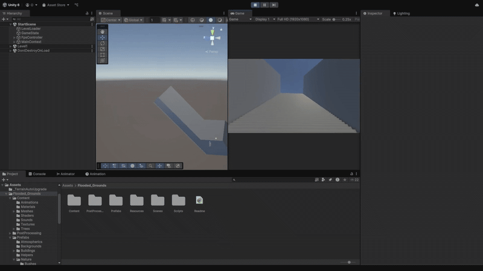
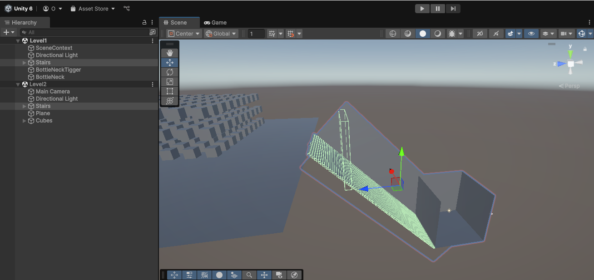

# Scene Manager

## Инструкция по установке
1. Скачайте [релиз](https://github.com/Ov3rl0rd1/Scene-Manager/releases/tag/Release).
2. Распакуйте архив и скопируйте файлы в проект.
3. Импортируйте в проект [Extenject](https://assetstore.unity.com/packages/tools/utilities/extenject-dependency-injection-ioc-157735) ([хороший урок](https://www.youtube.com/watch?v=h5rqKO72kfs) по фреймворку).
4. Создайте основную сцену и создайте в неё объект `Scene Context` (Zenject -> Scene Context)
   - В список Contract Names в Scene Context добавьте новый элэмент и назовите его `Main`
   - Создайте пустой объект и добавьте на него компонент `Level Loader`
   - Переместите на основную сцены все объкты, что не должны зависеть от конкретной сцены (игрок; интерфейс; скрипт, отвечающий за загрузку главого меню и т.д.)
   - Создайте в проекте `Mono Installer` (Create -> Zenject -> Mono Installer) и добавьте его в список `Mono Installers`. Этот скрипт будет отвечать за установку зависимостей Mono объектов (см. [подробнее](https://github.com/modesttree/Zenject?tab=readme-ov-file#documentation)). В него мы добавляем все нужные MonoBehaviour скрипты, которые находятся на основной сцене:
``` C#
using UnityEngine;
using Zenject;

public class SceneInstaller : MonoInstaller
{
    [SerializeField] private Player _player;
    [SerializeField] private LevelLoader _levelLoader;

    public override void InstallBindings()
    {
        Container.Bind<Player>().FromInstance(_player).AsSingle();
        Container.Bind<LevelLoader>().FromInstance(_levelLoader).AsSingle();
    }
}
```
5. Добавьте основную и другие нужные сцены в Scene List(File -> Build Profiles -> Scene List далее откройте нужную сцену и нажмите Add Open Scenes)
6. В поле `Start Scene Index` укажите индекс первого уровня (индекс можно сцены можно найти в Scene List напротив названия).
7. Во всех использующихся сценах выполните следующие действия:
     - Создайте Scene Context и добавьте в Parent Contract Names элемент с именем `Main`.
     - Убедитесь, что убрали со сцены все ссылки на объкты, которые теперь находятся на основной сцене(добавьте к каждому полю атрибут [Inject] и сделайте его приватным [пример](https://github.com/Ov3rl0rd1/Scene-Manager/blob/main/Assets/Scripts/SceneLoader/BottleNeckSceneLoader.cs#L13). Тепреь ссылка на объект этого типа будет установлена автоматически при загрузке сцены.).
     - Удалите все объкты, которые уже есть на основной сцене (игрок и т.д.).
9. Если нужно, то поменяйте [Player](https://github.com/Ov3rl0rd1/Scene-Manager/blob/c6114a38d4620699cc3b422124eca0bb75e754e0/Assets/Scripts/PlayerTrigger.cs#L7) в скрипте `PlayerTrigger.cs` на тип, который привязан к коллайдеру игрока
8. Готово!
## Как пользоваться?
1. Создайте пустой объект и добавьте на него скрипт `Bottle Neck Scene Loader`
   - В поле `Target Scene Index` укажите индекс сцены, на которую нужно переключиться.
   - В поле `Start Trigger` перенесите любой объект производный от типа `BaseSceneTrigger`, к примеру `PlayerTrigger` (Создайте пустой объект и добавьте на него `PlayerTrigger` и `Box Collider` с `Is Trigger` = `true`)
   - `On Start` вызывается, когда срабатывает триггер и начинается загрузка сцены
   - `On Scene Loaded` вызывается, когда загрузка сцены завершена, и начинается выгрузка старой.
   - P.S. Рекоминдуйтся при начале загрузки новой сцены отрезать игроку путь назад, ведь, после того как загризится новая сцена, старая будет выгружена.
2. Откройте в редакторе сразу два уровня (это можно сделать, нажав на вторую сцену правой кнопкой мыши и Open Scene Additive) и проверьте, что части локации, с переходом с одного уровня на другой, сходятся, как на скриншоте:

3. Готово!
